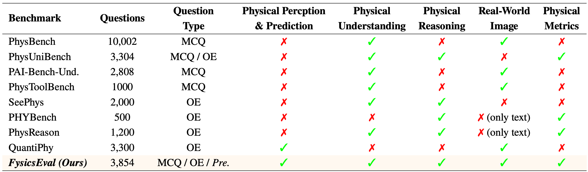

<p align="center" width="100%">
<a target="_blank"></a>
</p>

<div align="center">
<br>
<h1>FysicsEval：首个全维度具身物理感知与逻辑推理评测基准</h1>

<h5 align="center">如果你喜欢本项目，欢迎在 GitHub 点亮 ⭐ 以便获取最新进展。</h5>


<font size=7><div align='center' >
[[🏠 主页](https://github.com/Fysics-AI/FysicsEval)]
[[📖 论文](https://arxiv.org/pdf/xxxxxx)]
[[🤗 数据集](https://huggingface.co/datasets/Fysics-AI/FysicsEval)]
[[🏆 榜单](LEADERBOARD.md)]
[[🇬🇧 English](README.md)]
</div></font>

</div>

##  🚀   最新动态
- **`2026-02-05`** 发布 [**FysicsEval**](https://huggingface.co/datasets/Fysics-AI/FysicsEval)——国际首个全维度具身物理感知与逻辑推理评测基准。

## 🎯  项目概述
现有物理智能基准多集中在理论解题或定性情景分析，通常只考察直觉物理或问答能力，难以满足面向真实物理世界交互的下一代通用物理 AI 需求。为了全方位量化物理AI的认知边界，我们正式推出了 **FysicsEval** ——国际首个全维度具身物理感知与逻辑推理评测基准。该评测基准是一个面向多模态物理智能的全维度、多粒度评估系统，首次将物理感知与预测、物理逻辑推理、物理世界理解三大核心能力纳入同一评估体系，为通用多模态模型建立了物理认知能力的统一标尺。





**FysicsEval** 衡量了多模态模型在物理感知、定量预测、可解释推理以及跨模态物理一致性理解方面的能力。相较于只关注定性直觉或单一领域的过往数据集，**FysicsEval** 强调围绕三类核心能力的严格、多粒度评测：

- 基于真实多模态证据的物理属性**定量预测**。
- 基于守恒律与因果力学的可解释**物理推理**。
- 跨模态物理**一致性理解**与物理**幻觉检测**。


## 🔮  统计分类

**FysicsEval**包含了 3,854 个样本与 3,781 张真实世界图像，覆盖刚体、软体与流体三大类型；属性空间涵盖 11 类：刚度、密度、质量、静/动摩擦系数、恢复系数、杨氏模量、泊松比、黏度、表面张力、屈服应力。 **FysicsEval** 提供三类互补任务以刻画物理智能：

- **物理属性感知与预测** —— 给出定量数值估计。
- **可解释物理推理** —— 开放式回答，评测因果正确性。
- **跨模态物理一致性理解** —— 通过选择题检测物理不一致描述。

任务查询形式涵盖数值预测、开放式问答、选择题，并按三个难度层级分层，降低记忆捷径、提升泛化鲁棒性。

## 🔍  评测协议

- 物理属性预测以平均相对准确率（Mean Relative Accuracy, MRA）计分
- 一致性理解使用选择题准确率
- 开放式推理由 LLM 基于统一 rubric 在六个维度打分（语义一致性、参数精度、因果有效性、机制识别、链条完整性、定量–定性一致性）。评测使用固定提示与评分协议的 GPT-5。
- 所有评测脚本及 LLM 评测协议见 `metrics`。

## 🏆  排行榜

下表为各模型在 **FysicsEval** 上的综合成绩。`Reasoning×20` 为原推理得分放大 20 倍；`Average` 为 `Prediction`、`Reasoning×20`、`Understanding` 的均值，表格按 `Average` 降序排列。

| Model                         | Size | Prediction | Reasoning×20 | Understanding | Average |
|:------------------------------|:----:|:----------:|:------------:|:-------------:|:-------:|
| GPT-5                        |  -   | 40.3       | 69.60        | 89.9          | 66.60   |
| **OmniFysics (Ours)**                   | 3B   | 32.6       | 64.40        | 94.7          | 63.90   |
| Gemini-2.5-flash             |  -   | 19.8       | 62.00        | 89.4          | 57.07   |
| Qwen3-VL-8B-Instruct         | 8B   | 20.1       | 53.00        | 90.1          | 54.40   |
| Ovis2.5                      | 2B   | 20.4       | 49.20        | 89.5          | 53.03   |
| SAIL-VL2                     | 2B   | 21.9       | 51.60        | 84.7          | 52.73   |
| Claude-4.5-Haiku             |  -   | 35.3       | 57.80        | 60.3          | 51.13   |
| InternVL3.5-8B               | 8B   | 21.7       | 50.60        | 80.7          | 51.00   |
| Qwen2.5-Omni                 | 3B   | 18.1       | 34.20        | 87.5          | 46.60   |

说明：

- `Prediction`：平均相对准确率（越高越好）。
- `Reasoning×20`：原始推理得分 × 20。（注：原始推理得分为1-5分）
- `Understanding`：选择题准确率（百分比，越高越好）。
- `Average` = mean(`Prediction`, `Reasoning×20`, `Understanding`)。


## 🕹️ 使用方式

1. 从 HuggingFace 下载完整 **FysicsEval** 数据集，QA文件参考见 `data`。 
2. 按 `metrics` 中的评测脚本，评测模型输出结果。


## 📖 引用
如果你在研究中使用 **FysicsEval**，请引用：

```bibtex
@article{han2025exploringphysical,
    title={Exploring Physical Intelligence Emergence via Omni-Modal Architecture and Physical Data Engine},
    author={Han, Minghao and Yang, Dingkang and Jiang, Yue and Liu, Yizhou and Zhang, Lihua},
    journal={arXiv preprint arXiv:2602.xxxx},
    year={2026}
}
```

